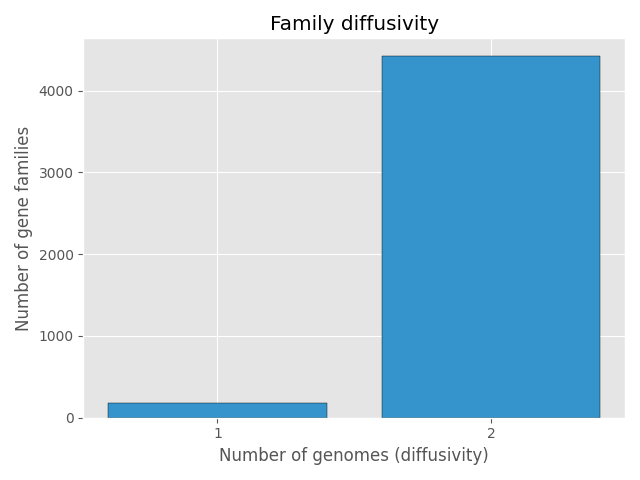
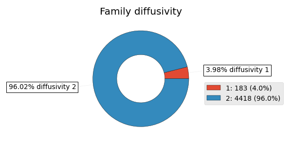
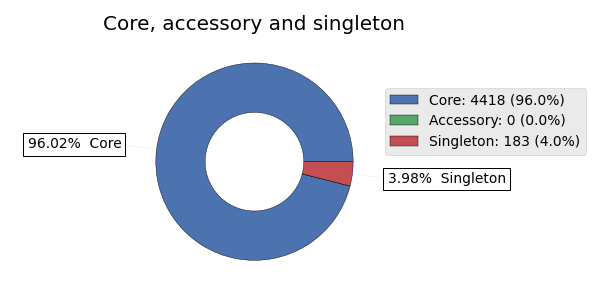

# PanDelos-plus

PanDelos-plus: a parallel algorithm for computing sequence homology in pangenomic analysis.

[](https://opensource.org/licenses/MIT) [](#lang-en)

<br>

## Contents

- [PanDelos-plus](#pandelos-plus)
  - [Contents](#contents)
  - [Introduction](#introduction)
  - [Use on your local machine](#use-on-your-local-machine)
    - [Installation](#installation)
    - [Usage](#usage)
  - [Use with docker](#use-with-docker)
    - [Installation](#installation-1)
    - [Usage](#usage-1)
  - [Run with a custom file](#run-with-a-custom-file)
    - [Local execution with custom file](#local-execution-with-custom-file)
    - [Docker execution with custom file](#docker-execution-with-custom-file)
  - [Advanced usage](#advanced-usage)
    - [Using gbff files as input](#using-gbff-files-as-input)
    - [Custom execution](#custom-execution)
    - [Discard value](#discard-value)
    - [Fragmented genes](#fragmented-genes)
    - [Similarity parameter](#similarity-parameter)
  - [Query pangenome](#query-pangenome)
    - [Example](#example)
      - [Plots](#plots)
      - [Files related to diffusivity analysis](#files-related-to-diffusivity-analysis)
      - [Files related to type analysis](#files-related-to-type-analysis)
  - [License](#license)
  - [Citation](#citation)

<br>

## Introduction

PanDelos-plus implements a dictionary-based method for pan-genome content discovery. This updated version is a re-engineered and parallelized C++ implementation of the original [PanDelos](https://github.com/InfOmics/PanDelos). It integrates several Python modules with a C++ library, coordinated via the `execute.sh` Bash script, which facilitates streamlined access to the complete PanDelos-plus pipeline.

<br>

## Use on your local machine

**Important**

Make sure to have git installed on your machine.

If you don't have git installed, you can install it with the following command on Ubuntu machine:

```bash
sudo apt-get install git
```

> If you don't have an ubuntu machine you can follow the instruction on the [Git website](https://git-scm.com/downloads).

Tool installation:

```bash
git clone https://github.com/synbionics/PanDelos-plus.git
```

### Installation

For the local installation on a ubuntu machine, you can run the following commands:

Required dependencies:

```bash
sudo apt update
sudo apt-get install -y bash python3 python3-pip python-virtualenv build-essential time git
```

Enter the cloned repository:

```bash
cd PanDelos-plus
```

Create and activate the virtual environment:

```bash
virtualenv -p python3 pdp_env
source pdp_env/bin/activate
```

Install required python packages:

```bash
python3 -m pip install -r pip-requirements.txt
```

Compile the tool:

```bash
bash compile.sh
```

### Usage

If you dont have the virtual environment activated, you can activate it with the following command:

```bash
source pdp_env/bin/activate
```

```bash
bash pandelosp.sh -i files/pdi/mycoplasma5.pdi -o mycoplasma5
```

This script will run the PanDelos-plus pipeline on the input file `files/pdi/mycoplasma5.pdi` and save the output in the `mycoplasma5.clus` and `mycoplasma5.json` files. The output files will contain the gene families computed by the pipeline.

Now you can deactivate the virtual environment with the following command:

```bash
deactivate
```

## Use with docker

sure to have git installed on your machine.

If you don't have git installed, you can install it with the following command on Ubuntu machine:

```bash
sudo apt-get install git
```

> If you don't have an ubuntu machine you can follow the instruction on the [Git website](https://git-scm.com/downloads).

Tool installation:

```bash
git clone https://github.com/synbionics/PanDelos-plus.git
```

### Installation

Make sure that you have docker installed on your machine.

If you don't have docker installed, you can install it following the instructions on the [Docker](https://docs.docker.com/engine/install/ubuntu/) website.

Move inside the `PanDelos-plus` folder:

```bash
cd PanDelos-plus
```

If you are running a linux machine, you probably need to change the permissions of the following folders:

```bash
chmod -R 777 input
chmod -R 777 output
```

Build the container:

**Important**

If you are on a windows machine you probably have to start docker engine by opening the docker desktop application.

```bash
docker compose build --no-cache
```

> Note that `docker compose` command may raise some errors so try also with `docker-compose`

### Usage

**Important**

Check that the input and output folders are writable by the user running the docker container.

Copy file inside the input folder:

```bash
cp files/pdi/mycoplasma5.pdi input/mycoplasma5.pdi
```

> If you are on windows you probably have to use `cp .\files\pdi\mycoplasma5.pdi input\mycoplasma5.pdi`

Run the pipeline:

```bash
docker compose run --rm pandelosplus bash pandelosp.sh -i input/mycoplasma5.pdi -o output/mycoplasma5
```

> Note that `docker compose` command may raise some errors so try also with `docker-compose`

This script will run the PanDelos-plus pipeline inside the docker on the input file `input/mycoplasma5.pdi` and save the output in the `output/mycoplasma5.clus` and `output/mycoplasma5.json` files.

The output files will contain the gene families computed by the pipeline.

## Run with a custom file

PanDelos-plus takes as input a complete set of gene sequences stored in a `.pdi` text file belonging to any of the studied genomes.

This file must have a "2 line pattern" where:

-   The first line represents the identification line, composed of 3 parts (genome identifier, the gene identifier and the gene product) separated by a **tabulation** character.
-   The second line consists of the complete gene sequence in FASTA amino acid format reported in a single line.

**_IMPORTANT_**
No blank lines are admitted in the entire file.

Example of valid file composed of 5 genes grouped in 2 genomes

```pdi
NC_000913	NC_000913:NC_000913.3:b0001:1	thr operon leader peptide
MKRISTTITTTITITTGNGAG
NC_000913	NC_000913:NC_000913.3:b0005:1	DUF2502 domain-containing protein YaaX
MKKMQSIVLALSLVLVAPMAAQAAEITLVPSVKLQIGDRDNRGYYWDGGHWRDHGWWKQHYEWRGNRWHLHGPPPPPRHHKKAPHDHHGGHGPGKHHR
NC_000913	NC_000913:NC_000913.3:b0018:1	regulatory protein MokC
MLNTCRVPLTDRKVKEKRAMKQHKAMIVALIVICITAVVAALVTRKDLCEVHIRTGQTEVAVFTAYESE
NC_007946	NC_007946:NC_007946.1:UTI89_RS06140:1	DUF1382 family protein
MHKASPVELRTSIDLAHSLAQIGVRFVPIPAETDEEFHTLATSLSQKLEMMVAKAEADERDQV
NC_007946	NC_007946:NC_007946.1:UTI89_RS06145:1	DUF1317 domain-containing protein
MTHPHDNIRVGAITFVYSVTKRGWVFHGLSVIRNPLKAQRLAEEINNKRGAVCTKHLLLS
```

**_IMPORTANT_**
Make sure that gene identifiers are unique within the input file. A suggested format to build unique gene identifier is `genome_identifier:gene_identifier:unque_integer`.

### Local execution with custom file

Remember to activate the virtual environment:

```bash
source pdp_env/bin/activate
```

After you have prepared your input file (supposing it is named as `input.pdi`), you can run the pipeline as follows:

```bash
bash pandelosp.sh -i input.pdi -o output
```

The output files will contain the gene families computed by the pipeline.

Remember to deactivate the virtual environment:

```bash
deactivate
```

### Docker execution with custom file

After you have prepared your input file (supposing it is in the `input` folder and is named `custom.pdi`), you can run the pipeline as follows:

Run the pipeline:

```bash
docker compose run --rm pandelosplus bash pandelosp.sh -i input/custom.pdi -o output/custom
```

This script will run the PanDelos-plus pipeline inside the docker on the input file `input/custom.pdi` and save the output in the `output/custom.clus` file.
The output files will contain the gene families computed by the pipeline.

## Advanced usage

**Important**
If you installed pandeslos-plus with docker you must enter inside the container to execute the following steps.

```bash
docker compose run --rm pandelosplus bash
```

### Using gbff files as input

You can generate an input file from a set of `.gbff` files following these steps:

1.  Download the genbank files of your interest.
2.  Create a folder and copy all `.gbff` files in it.
3.  Run the execution script by adding `-g <path_to_folder_with_gbff_files>` flag to the execution command to generate a json file in addition to the output file.

Example:

> Extract files from `files/gbff.zip`.

In this example it will be used files contained in `files/gbff/` folder which contains 2 genomes downloaded from NIH Database:

-   GCF_016028495.1, for Salmonella enterica (ASM1602849v1).
-   GCF_000006945.2, for Salmonella enterica (ASM694v2).

> So steps 1 and 2 are already done.

Step 3:

```bash
bash pandelosp.sh -i custom.pdi -o custom -g files/gbff/
```

If everithing works fine you will get this output:

```bash
mar 18 mar 2025, 10:21:38, CET
Using files contained in: files/gbff/
Converting gbff to gbk
['GCA_000006945.2.gbff', 'GCA_016028495.1.gbff']
Checking gbk files
This may take a while
Reading gbk files from: files/gbff//gbk/
Files found: ['GCA_000006945.2.gbk', 'GCA_016028495.1.gbk']
Processing file: GCA_000006945.2.gbk
Processing genome: GCA_000006945.2
        Genome ID: GCA_000006945.2      Sequence ID: AE006468.2
        Genome ID: GCA_000006945.2      Sequence ID: AE006471.2
Processing file: GCA_016028495.1.gbk
Processing genome: GCA_016028495.1
        Genome ID: GCA_016028495.1      Sequence ID: CP065718.1
        Genome ID: GCA_016028495.1      Sequence ID: CP065719.1
All files processed successfully
Generating pdi input file
This may take a while
reading gbk files from files/gbff//gbk/
['GCA_000006945.2.gbk', 'GCA_016028495.1.gbk']
GCA_000006945.2.gbk
GCA_000006945.2
        GCA_000006945.2 AE006468.2
        GCA_000006945.2 AE006471.2
GCA_016028495.1.gbk
GCA_016028495.1
        GCA_016028495.1 CP065718.1
        GCA_016028495.1 CP065719.1
writing to custom.pdi
custom.pdi
k = 4
Checking input file (.pdi)
File is correct
Executing main
Computing clusters
Converting clusters to json with GeneBank information
mar 18 mar 2025, 10:21:54, CET
```

Now you can check the output file `custom.clus` and the json file `custom.json`.

> Note that the json file is enriched with the information from the GenBank files.

### Custom execution

You can customize the execution of the pipeline by using the following flags:
| Flag | Description |
|------|-------------|
| -i | Input file path |
| -o | Output file path |
| -t | Number of threads |
| -m | Enable a slower mode which requires less memory (default: False) |
| -d | Discard value (0 <= d <= 1, default 0.5), check the section below |
| -g | Path to gbk folder |
| -f | For fragmented genes, check the section below |
| -p | For a stronger threshold (similarity parameter), check the section below |
| -h | Display this help message |

You can also check the help message by running:

```bash
bash pandelosp.sh -h
```

You will get this output:

```bash
Usage: execute.sh [-i input_file] [-o output_file] [-t thread_num] [-m] [-d discard_value] [-g path to gbks][-h]
Options:
  -i: Input file path
  -o: Output file path
  -t: Number of threads
  -m: Enable a different mode
  -d: Discard value (0 <= d <= 1, default 0.5)
  -g: Path to gbk folder
  -f: For fragmented genes
  -p: For a stronger threshold (similarity parameter)
  -h: Display this help message
```

### Discard value

The discard value (`-d`) is a threshold that is used to decide whether to compare two genes.
This type of decision is made based on the length of the genes.

```pdi
NC_000913	NC_000913:NC_000913.3:b0001:1	thr operon leader peptide
MKRISTTITTTITITTGNGAG
NC_000913	NC_000913:NC_000913.3:b0018:1	regulatory protein MokC
MLNTCRVPLTDRKVKEKRAMKQHKAMIVALIVICITAVVAALVTRKDLCEVHIRTGQTEVAVFTAYESE
```

In the case of this pair the gene identified by `NC_000913:NC_000913.3:b0001:1` has a length equal to $69$ and the other has length equal to $21$ so a discard greater than $0.2$ will skip this comparison

### Fragmented genes

PanDelos-plus can handle fragmented genes. To use this feature the input file must be formatted as described in the following lines.

This file must have a "2 line pattern" where:

-   The first line represents the identification line, composed of 4 parts (genome identifier, the gene identifier, the gene product and the number of inferred characters) separated by a **tabulation** character.
-   The second line consists of the complete gene sequence in FASTA amino acid format reported in a single line.

**_IMPORTANT_**
No blank lines are admitted in the entire file.

Example of valid file composed of 5 genes grouped in 2 genomes for fragmented genes

```pdi
NC_000913	NC_000913:NC_000913.3:b0001:1	thr operon leader peptide   5
MKRISTTITTTITITTGNGAG
NC_000913	NC_000913:NC_000913.3:b0005:1	DUF2502 domain-containing protein YaaX  20
MKKMQSIVLALSLVLVAPMAAQAAEITLVPSVKLQIGDRDNRGYYWDGGHWRDHGWWKQHYEWRGNRWHLHGPPPPPRHHKKAPHDHHGGHGPGKHHR
NC_000913	NC_000913:NC_000913.3:b0018:1	regulatory protein MokC   30
MLNTCRVPLTDRKVKEKRAMKQHKAMIVALIVICITAVVAALVTRKDLCEVHIRTGQTEVAVFTAYESE
NC_007946	NC_007946:NC_007946.1:UTI89_RS06140:1	DUF1382 family protein  10
MHKASPVELRTSIDLAHSLAQIGVRFVPIPAETDEEFHTLATSLSQKLEMMVAKAEADERDQV
NC_007946	NC_007946:NC_007946.1:UTI89_RS06145:1	DUF1317 domain-containing protein   5
MTHPHDNIRVGAITFVYSVTKRGWVFHGLSVIRNPLKAQRLAEEINNKRGAVCTKHLLLS
```

**_IMPORTANT_**
Make sure that gene identifiers are unique within the input file. A suggested format to build unique gene identifier is `genome_identifier:gene_identifier:unque_integer`.

This feature will be used inside the following pipelines:

-   [PanDelos-plus-frags](https://github.com/synbionics/PanDelos-plus-frags), not release yet

Another pipeline that will use this feature is [PanDelos-frags](https://github.com/InfOmics/PanDelos-frags)

### Similarity parameter

The similarity parameter (`-p`) is a threshold that is used to decide whether keep or discard a value obtained from the comparison of two genes.
This type of decision is made on the similarity of the two genes, if the similarity is greater than an specific value, the computed value is kept.
Otherwise, it is discarded.

Using the `-p` flag you will use an higher threshold to make the decision, so more values will not be considered.

## Query pangenome

After the computation of the clusters, you can query the pangenome using the `query_pangenome.py` script.

```bash
python3 python3 query_pangenome.py -i <path_to_json_file>.json -o <path_to_output_folder> -c <gene_threshold_for_core> [-f < list | mutifasta | all>]
```

> Remember to activate the virtual environment before running the script. You can do this by running the following command:
>
> ```bash
> source pdp_env/bin/activate
> ```

| Flag | Description                                                                                                                                                                                                                                  |
| ---- | -------------------------------------------------------------------------------------------------------------------------------------------------------------------------------------------------------------------------------------------- |
| -i   | Input file path. (`.json`)                                                                                                                                                                                                                   |
| -o   | Output folder path.                                                                                                                                                                                                                          |
| -f   | Create additional output files. Use `list` if you are interested only to gene identifiers; use `multifasta` if you are interested to get gene identifier and respective sequence in a multifasta format. If you want both you can use `all`. |
| -h   | Display this help message.                                                                                                                                                                                                                   |

You can also check the help message by running:

```bash
python3 query_pangenome.py -h
```

You will get this output:

```bash
usage: query_pangenome.py [-h] -i INPUT -o OUTPUT -c CORE [-f {none,list,multifasta,all}]

Program to process files with output options.

options:
  -h, --help            show this help message and exit
  -i, --input INPUT     input file to process
  -o, --output OUTPUT   output folder for results
  -c, --core CORE       core threshold, the minimun number of genomes that a gene must be present in to be considered core
  -f, --format {none,list,multifasta,all}
                        format of files to generate in addition to graphs
```

### Example

Supposing that you have executed the example of execution with custom gbff files above and you have the following files in `output` folder:

-   `custom.clus`
-   `custom.json`

You can query the pangenome using the following command:

```bash
python3 query_pangenome.py -i output/custom.json -o output/ -c 2 -f all
```

You will obtain the following output:

```bash
Processing file 'output/custom.json'...
Results will be saved to 'output/'
Running core analysis...
Core analysis completed successfully.
Running diffusivity analysis...
Diffusivity analysis completed successfully.
Generating presence/absence matrix...
Presence/absence matrix generated successfully.
All processing completed successfully.
```

Now your `output` folder will have the following contents:

```bash
output
├── custom.clus
├── custom.json
├── diffusivity
│   ├── list
│   │   ├── diffusivity_1.txt
│   │   └── diffusivity_2.txt
│   └── multifasta
│       ├── diffusivity_1.ffn
│       └── diffusivity_2.ffn
├── gene_type.png
├── hist_family_diffusivity.png
├── matrix.csv
├── pie_family_diffusivity.png
└── types
    ├── list
    │   ├── accessory.txt
    │   ├── core.txt
    │   └── singleton.txt
    └── multifasta
        ├── accessory.ffn
        ├── core.ffn
        └── singleton.ffn
```

Where:

-   `diffusivity` folder contains the diffusivity analysis results.
    -   `list` folder contains the diffusivity analysis results in a list format.
    -   `multifasta` folder contains the diffusivity analysis results in a multifasta format.
-   `gene_type.png` is a plot of the gene types (core, accessory, singleton) in the pangenome.
-   `hist_family_diffusivity.png` is a histogram of the diffusivity distribution of the gene families.
-   `pie_family_diffusivity.png` is a pie chart of the diffusivity distribution of the gene families.
-   `matrix.csv` is a matrix of the presence/absence of the gene families in the genomes.
-   `types` folder contains the gene types (core, accessory, singleton) in the pangenome.
    -   `list` folder contains the gene types in a list format.
    -   `multifasta` folder contains the gene types in a multifasta format.

#### Plots

For the `diffusivity` analysis:




For the `gene_type` analysis:



#### Files related to diffusivity analysis

If you used `-f list` or `-f all`, you will find in the `diffusivity/list` folder the following files:

-   `diffusivity_1.txt` contains the genes identifiers with diffusivity 1.
-   `diffusivity_2.txt` contains the genes identifiers with diffusivity 2.

> If you will have use than 2 genomes, you will find more files in the `list` folder. With the format `diffusivity_N.txt`, where `N` is the diffusivity of the genes inside the file.

In the `diffusivity` folder you will find in `multifasta` folder:

If you used `-f multifasta` or `-f all`, you will find in the `diffusivity/multifasta` folder the following files:

-   `diffusivity_1.ffn` contains the genes with diffusivity 1, in multifasta format.
-   `diffusivity_2.ffn` contains the genes with diffusivity 2, in multifasta format.

> If you will use more than 2 genomes, you will find more files in the `multifasta` folder. With the format `diffusivity_N.ffn`, where `N` is the diffusivity of the genes inside the file.

#### Files related to type analysis

If you used `-f list` or `-f all`, you will find in the `types/list` folder the following files:

-   `accessory.txt` contains the genes identifiers of the accessory genes.
-   `core.txt` contains the genes identifiers of the accessory genes.
-   `singleton.txt` contains the genes identifiers of the accessory genes.

If you used `-f multifasta` or `-f all`, you will find in the `types/multifasta` folder the following files:
-   `accessory.ffn` contains the accessory genes, in multifasta format.
-   `core.ffn` contains the core genes, in multifasta format.
-   `singleton.ffn` contains the singleton genes, in multifasta format.

## License

PanDelos-plus is distributed under the MIT license. This means that it is free for both academic and commercial use. Note, however, that some third-party components in PanDelos-plus require you to reference certain works in scientific publications. You are free to link or use PanDelos-plus inside the source code of your own program. If you do so, please reference (cite) PanDelos-plus and this website. Bug fixes and collaboration for improvements are appreciated.

## Citation

PanDelos-Plus has been presented at BBCC2024 - the 19th annual edition of the conference, November 27-29, 2024, in Naples, Italy.

<br>

Published 18 nov 2024 [https://doi.org/10.7490/f1000research.1120001.1](https://doi.org/10.7490/f1000research.1120001.1)

Original PanDelos software:

     Bonnici, V., Giugno, R., Manca, V.
     PanDelos: a dictionary-based method for pan-genome content discovery
     BMC bioinformatics 19.15 (2018): 437.

If you have used any of the PanDelos-plus project software, please cite the the following paper:

<!-- TODO add citation -->

```

```

```

```
